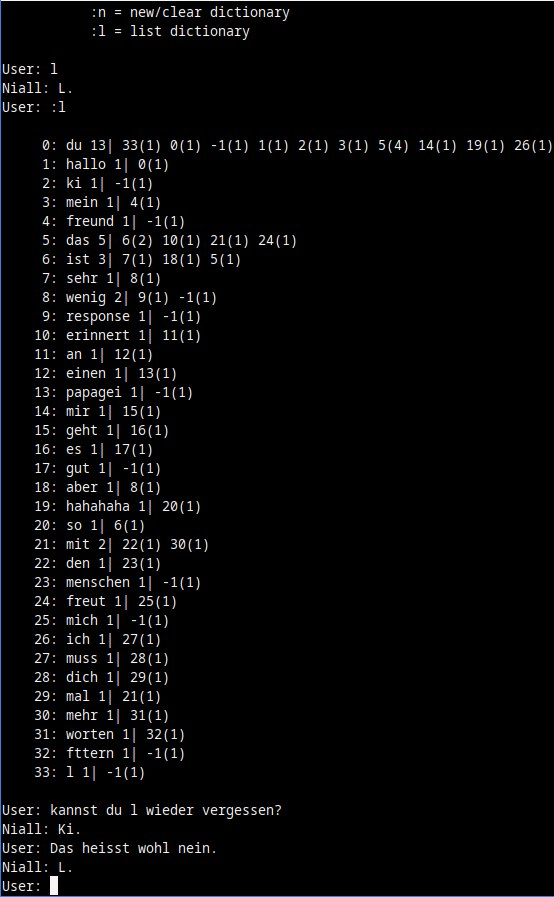

# Niall CLI (pre-beta version)

Non-Intelligent AMOS Language Learner, c-code

## Code base

- 97% code based on gNiall By Gary Benson in 1999, GPL
- in past a had a lot of fun with niallPC from in 1992, win3.1
- original code is Written By Matthew Peck in 1990

This version is an ugly hack to have a small cli interface and text import.

## Features

- makes/uses assoc word list and statistics from incomming text
- `./niall.exe a-lot-of-text.txt new-dictinoary.dict` creates dictionary
- `./niall.exe new-dictinoary.dict` load or create empty dictionary

in chat commands:

- `:s` save actual dictionary
- `:l` list dictionary
- `:n` new/clear dictionary
- `:q` quit

## Example Chat

## Compile

`gcc niall.c -O2 -mtune=native -Wall -o niall.exe`
